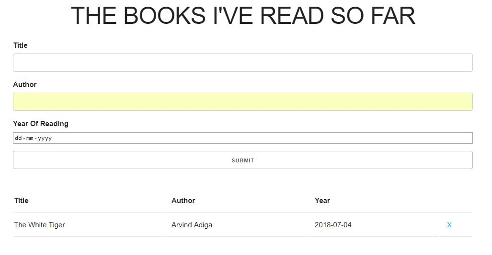
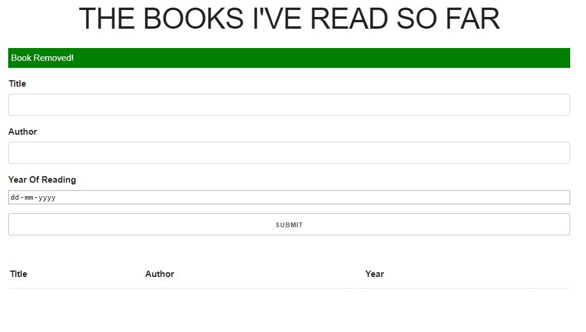
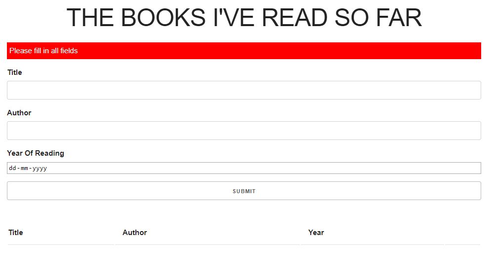

# Books I've read so far

Live on - https://shomikg.github.io/BookList/
A short interactive app developed using Vanilla JS to keep a track of all the books you've read so far.

## Technologies Used in this repo

* JavaScript ES6: plain JS (as opposed to jQuery, etc.) is used to dynamically query, create, modify, and remove HTML elements/nodes
* Skeleton: front-end CSS framework

## Features

1. A message appears if the user submits without giving any input.

2. The app keeps a count of all the books you've entered along with their year of reading and author name. Feel free to suggest more column names to it.

   
   

## Thoughts

Validation in Javscript is so much fun.
